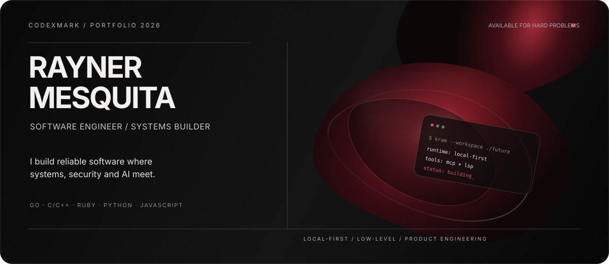

 

## Olá, eu sou o Rayner.

Engenheiro de software e construtor de sistemas com uma trajetória iniciada em **2004**. Gosto de problemas que exigem atravessar camadas: da memória e da rede à arquitetura de produto, da automação à experiência de quem usa.

Hoje concentro meu trabalho na interseção entre **engenharia de sistemas, segurança e inteligência artificial** — criando ferramentas locais, aplicações completas e infraestrutura que permanece compreensível, observável e sob controle.

> **Meu princípio de engenharia:** tecnologia sofisticada só é realmente boa quando continua confiável no mundo real.

## Em foco agora — Kram

Estou construindo o **[Kram](https://github.com/codexmark/kram)**, um runtime *local-first* para agentes de programação, gateway multi-provider de LLMs e workspace de terminal — implementado do zero em **Go**.

- binário único e multiplataforma;
- agent loop com ferramentas, permissões e aprovações;
- integração com **MCP** e **LSP**;
- TUI com telemetria real de execução;
- memória, sessões e estado persistidos localmente;
- roteamento, fallback e normalização entre provedores de IA;
- foco em confiabilidade, observabilidade e economia de contexto.

**[Conheça a arquitetura →](https://github.com/codexmark/kram#readme)**

 

## O que eu construo

<table>
  <tr>
    <td width="50%" valign="top">
      <h3>◉ Sistemas & IA</h3>
      Runtimes de agentes, gateways de LLM, ferramentas CLI/TUI, integração MCP/LSP, persistência local e automação de workflows.
    </td>
    <td width="50%" valign="top">
      <h3>◌ Segurança & baixo nível</h3>
      Engenharia reversa, análise de memória, protocolos de rede, anti-cheat, hardening de aplicações, regras de firewall e fundamentos CompTIA Security+.
    </td>
  </tr>
  <tr>
    <td width="50%" valign="top">
      <h3>◇ Produtos completos</h3>
      APIs, aplicações web e mobile, autenticação, CRUDs, integrações, bancos relacionais e deploy serverless.
    </td>
    <td width="50%" valign="top">
      <h3>↗ Modernização</h3>
      Evolução de sistemas legados, atualização de stacks, melhorias de segurança, experiência de terminal e arquitetura.
    </td>
  </tr>
</table>

## Stack de trabalho

**Sistemas e backend**

**Produto e plataforma**

**Dados, infraestrutura e ferramentas**

## Projetos selecionados

| Projeto | O problema | Engenharia |
|---|---|---|
| **[Kram](https://github.com/codexmark/kram)** | Agentes de código locais, observáveis e independentes de provedor | Go · LLM gateway · MCP · LSP · TUI · SQLite |
| **[Req. Codex](https://github.com/codexmark/Req.)** | Elicitação e organização de requisitos com colaboração via Discord | JavaScript · Vercel Functions · Redis/Upstash · autenticação |
| **[T-UI Launcher](https://github.com/codexmark/TUI-ConsoleLauncher-morto-)** | Modernização e hardening de um launcher Android em formato terminal | Java 17 · Android API 34 · OWASP MASVS · BusyBox |
| **[Biblioteca IDEP](https://github.com/codexmark/Biblioteca_IDEP)** | Gestão educacional de acervo e usuários | Python · Flask · SQLite |
| **[Codex Anti-Cheat](https://github.com/codexmark/CodexAC_RF-Online_Anti-Cheat)** | Proteção de clientes e servidores de RF Online | C/C++ · memória · análise de binários · defesa |
| **[MikroTik Firewall Rules](https://github.com/codexmark/BasicMkFirewallrules)** | Hardening de borda contra scans, floods e tráfego inválido | RouterOS · filtros stateful · mitigação de ataques |

## Da curiosidade ofensiva à engenharia defensiva

Minha entrada na programação aconteceu explorando jogos: memória, pacotes, binários e as fronteiras entre cliente e servidor. Com o tempo, transformei esse conhecimento em defesa — desenvolvendo anti-cheats, endurecendo sistemas e projetando controles com uma compreensão prática de como eles podem falhar.

Essa origem ainda define meu jeito de trabalhar: entender o sistema por inteiro, desconfiar de abstrações frágeis e construir mecanismos explícitos de segurança e recuperação.

## Como eu penso engenharia

<code>entender profundamente → reduzir a complexidade → tornar observável → automatizar com controle</code>

- **Local-first quando faz sentido:** dados e decisões perto de quem opera o sistema.
- **Confiabilidade antes de espetáculo:** erros visíveis, limitados e recuperáveis.
- **Segurança como arquitetura:** não como uma etapa adicionada no final.
- **Produto de ponta a ponta:** backend, interface, deploy e operação fazem parte do mesmo problema.
- **Aprendizado contínuo:** mais de duas décadas programando e ainda escolhendo desafios que me obrigam a evoluir.

---

### Vamos construir algo difícil — e fazer funcionar de verdade.

[LinkedIn](https://www.linkedin.com/in/raynermesquita) · [Projetos](https://github.com/codexmark?tab=repositories) · [Kram](https://github.com/codexmark/kram)

Porto Velho, Rondônia · Brasil

